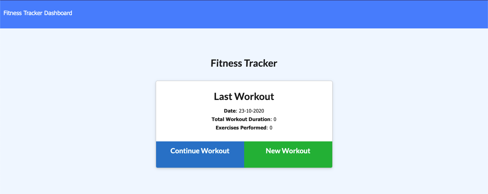
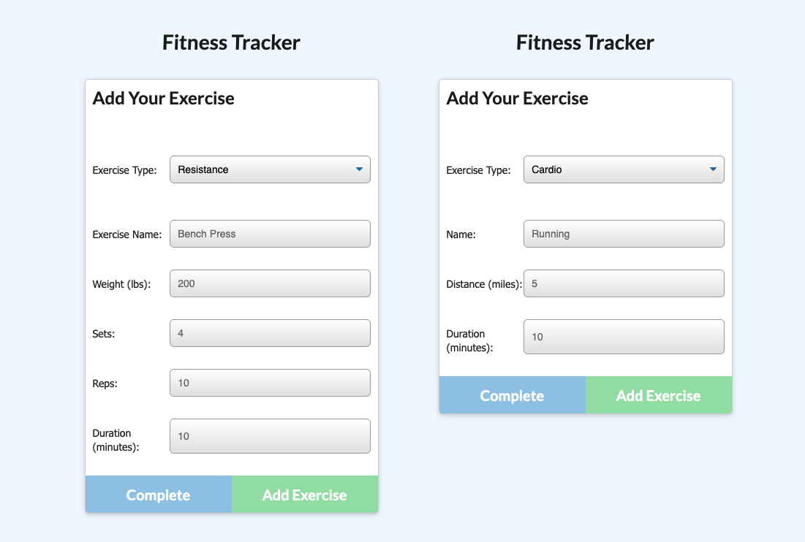
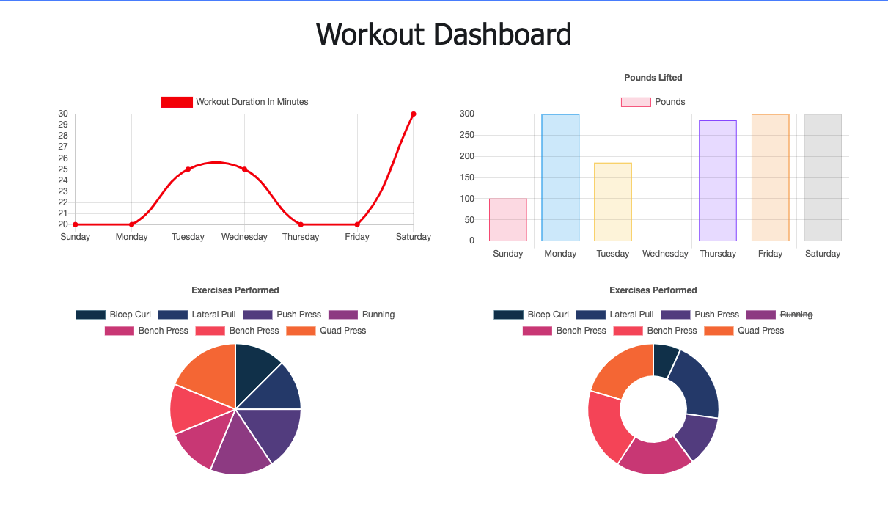

# Workout Tracker

Workout tracker makes use of MongoDB Atlas to host your workout data in the cloud. You can use workout tracker to make note of which exercises you performed on each day, and then view your recent workout data as displayed conveniently in several charts.

Click here to navigate to the workout tracker --> [Link to Deployed Site](https://spacialfray-workout-tracker.herokuapp.com/)

## Usage

### Index

The first page of the workout tracker shows you a brief summary of your most recent workout, and allows you to either add another exercise to that workout by clicking "Continue Workout", or start a "New Workout".

Whichever button you click, you will be directed to the /exercise page.

### /exercise

On this page, you can choose from two types of exercise to enter: cardio or resistance. Once you select one of those options in the dropdown, the rest of the form becomes visible. I have included a picture of both versions of the form side by side, but you will only see one at a time depending on what you've selected in the dropdown "Exercise Type".

Once the form is filled in, you can either click "complete", which will navigate you back to the index, or "Add Exercise", which will log this exercise to the database without redirecting you away from the current page.

### /stats

You can access this page any time by clicking on the "Dashboard" link in the nav bar.

This page displays data from your 7 most recent workouts in several charts.

---

## License

